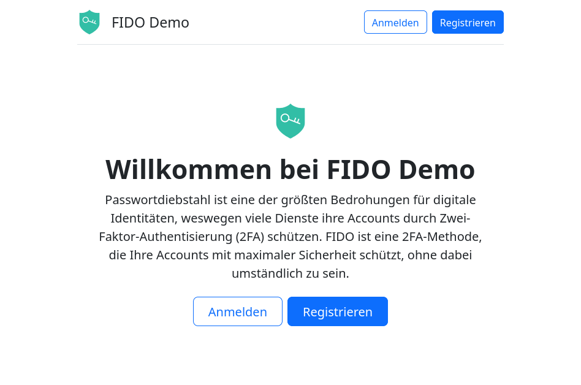
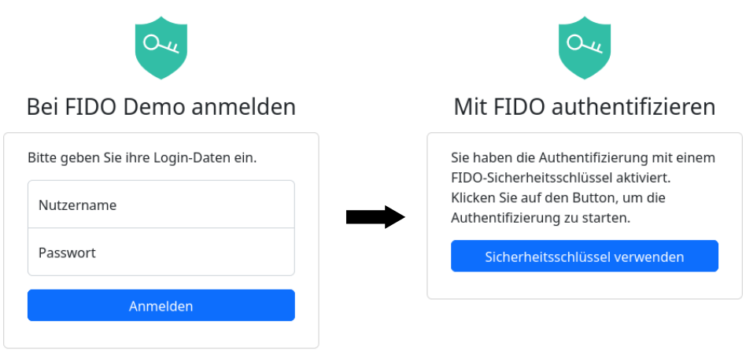

# FIDO 2FA Authentication Demo

Dieses Projekt demonstriert eine sichere Zwei-Faktor-Authentifizierungen mit FIDO für Websites. Es wurde in Python mit dem Flask-Framework erstellt.

Nutzer sind in der Lage, neue Accounts anzulegen und sich bei bestehenden Accounts mit Nutzernamen und Passwort anzumelden. Wenn die Nutzer einen FIDO-Sicherheitsschlüssel eingerichtet haben (optional), wird dieser bei der Anmeldung ebenfalls abgefragt und der Account so vor Identitätsdiebstahl geschützt.

Alle Daten werden in einer leichtgewichtigen Datenbank persistiert. Passwörter werden niemals im Klartext, sondern nur gehashed und gesalted gespeichert.

Bei der Entwicklung wurde großer Wert auf Sicherheit gelegt. Die Anwendung ist vor XSS, CORS, CSRF, Clickjacking und SQL-Injections geschützt.

## Features

- Einen Account mit Nutzernamen und Passwort anlegen
- Mit Nutzernamen und Passwort anmelden
- FIDO-Sicherheitsschlüssel zu einem Account hinzufügen (während der Erstellung des Accounts oder nachträglich)
- Mit Nutzernamen und Passwort (erster Faktor) und FIDO (zweiter Faktor) anmelden

## Hosting der Anwendung

Aus Sicherheitsgründen lassen Browser die Verwendung von FIDO nur auf Webseiten zu, die mit HTTPS übertragen werden. Der Browser stellt sicher, dass das Zertifikat gültig ist (z. B. nicht abgelaufen, die Domain der Webseite ist identisch mit der Domain des Zertifikats, usw.) und verhindert andernfalls die Verwendung von FIDO.

Um die Anwendung selbst zu hosten, müssen Sie daher ein gültiges Zertifikat verwenden. Die Anwendung generiert derzeit ein selbstsigniertes Zertifikat zur Laufzeit.

Aufgrund des selbstsignierten Zertifikats ist die Nutzung von FIDO nicht möglich, wenn die Anwendung über eine Domain oder eine IP-Adresse genutzt wird. Die meisten Browser behandeln jedoch `localhost` speziell und erlauben die Verwendung von FIDO, wenn die Webseite von `localhost` abgerufen wird.

## Lokales Ausführen

Um dieses Projekt lokal auszuführen, müssen Sie alle Abhängigkeiten installieren. Führen Sie dazu diese Befehle aus:

    pip3 install -r requirements.txt
    python3 server.py

Die Anwendung ist dann unter **https://localhost:5000** erreichbar. Beachten Sie, dass der Browser FIDO für jeden anderen Host (z. B. 127.0.0.1) aufgrund der im vorherigen Abschnitt erwähnten Sicherheitseinschränkungen blockiert.

Der Server speichert seine Datenbank im Ordner `database`.

## Mit Docker ausführen

Es ist möglich, dieses Projekt in einem Docker-Container auszuführen. Dazu müssen Sie docker installieren. Dann können Sie die folgenden Befehle ausführen:

    docker build -t fido:1.0 .
    docker run -ti -p 8000:8000 fido:1.0

Die Anwendung ist unter **https://localhost:8000** erreichbar. Beachten Sie, dass die Verwendung von HTTP**S** obligatorisch ist; der Server antwortet nicht auf HTTP-Anfragen.

Das vorherige Beispiel speichert die Datenbank im Container. Führen Sie die nachfolgenden Befehle auf einem UNIX-ähnlichen System (macOS oder Linux) aus, wenn Sie die Datenbank auf Ihrer Festplatte speichern möchten:

    mkdir database
    chmod -R a+rwx database
    docker run -ti -p 8000:8000 --mount type=bind,source="$(pwd)/database",target=/app/database fido:1.0
